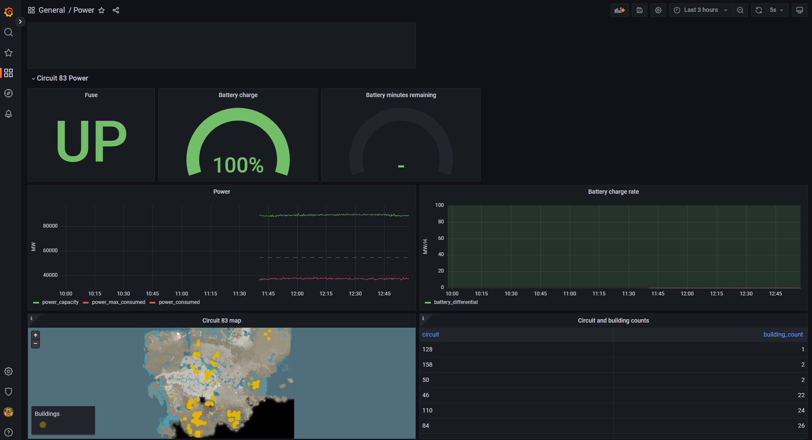
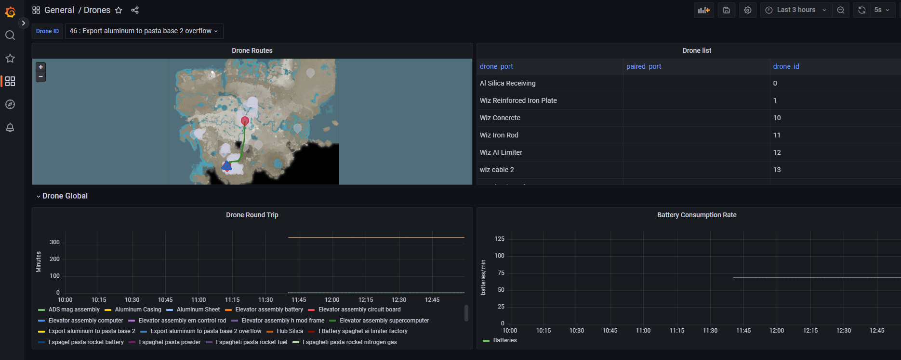
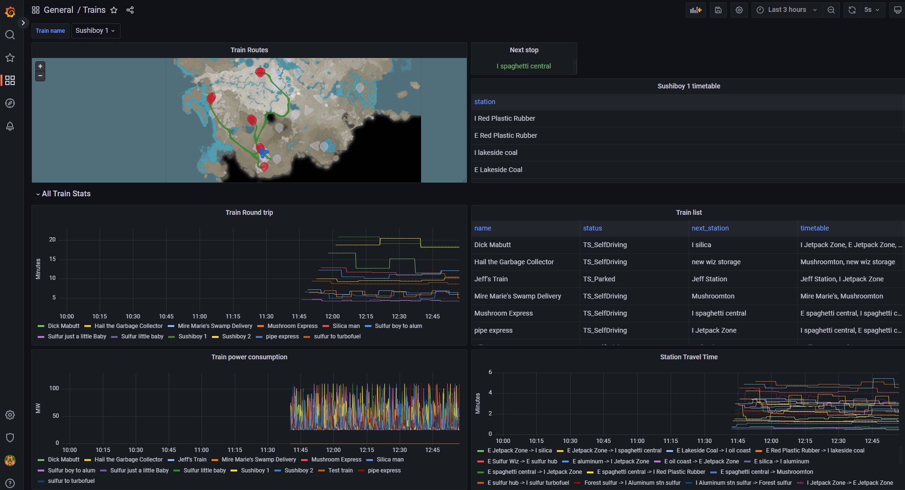
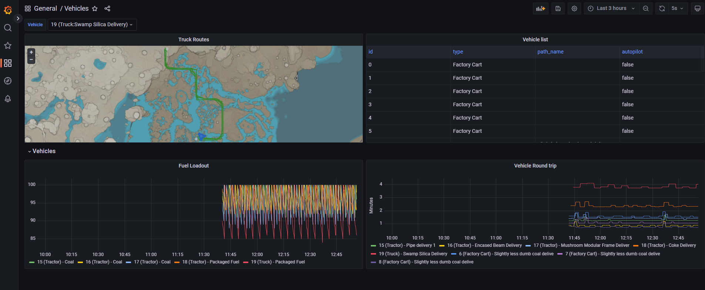
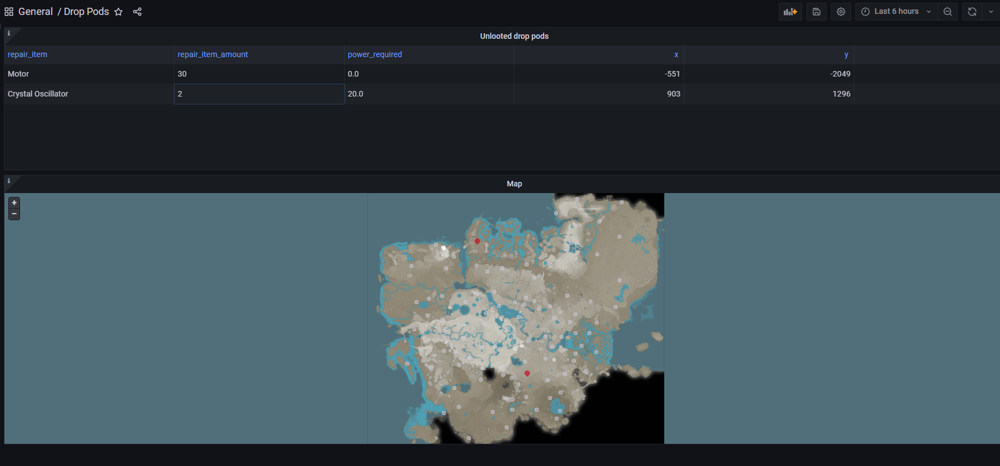
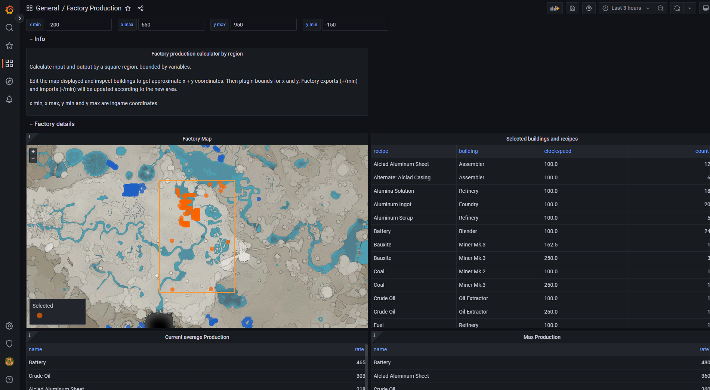
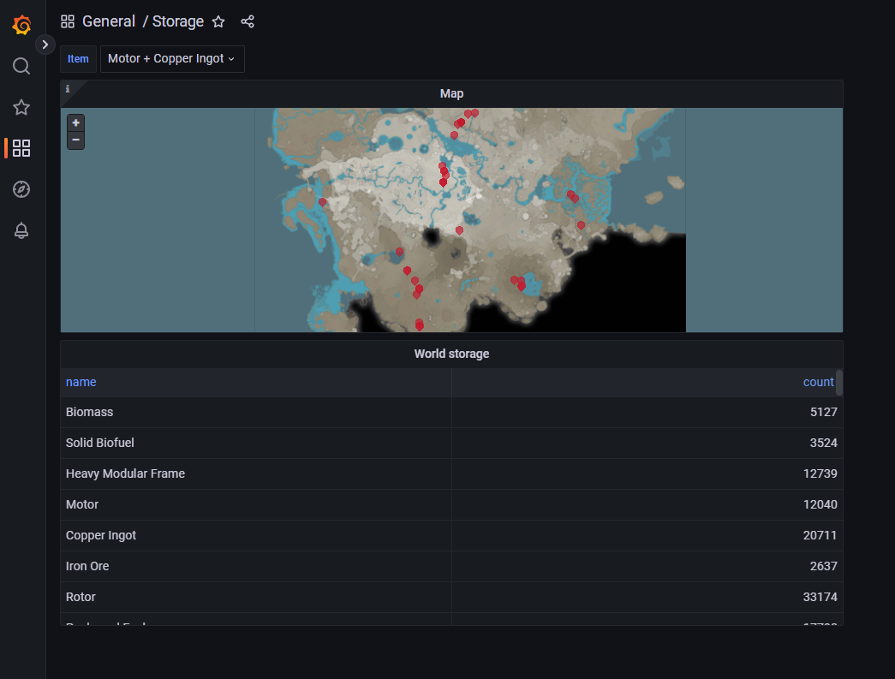

# Ficsit Remote Monitoring Companion Bundle

A docker compose setup for Ficsit Remote Monitoring and alerting. Requires [FicsitRemoteMonitoring](https://ficsit.app/mod/FicsitRemoteMonitoring) plugin.
With FicsitRemoteMonitoring plugin, make sure you boot the http server `/frmweb start` in game or autostart the webserver.

Configured to view dashboards and alerts including:

## Production overview


View global production stats - current vs max production, and production/consumption per item, over time.

View overconsumption/underproduction alerts so your factories can stay efficient.

## Power grid


Overview of power and battery, as well as a map of what locations the power grid is serving.

View power alerts so you are alerted of power problems before any circuits trip.

## Drones


View drone paths, round trip times, and battery consumption rates.

## Trains


View train paths, timetables, round trip times, and station travel times.
Timeseries allows you to view how changes to tracks or added trains affect station travel times.

## Trucks


View truck paths, round trip times, and fuel consumption.

## Drop pod locations


View drop pod locations of opened vs unopened drop pods, using a map that updates in real time.

## Factory Production


Inspect a square grid subsection of production buildings. Allows you to inspect the group's production vs consumption rates.

## Storage


Search for items in containers on the map.

## Discord alerts


Discord alerting for tripped grids.

## Env Vars

- `FRM_HOST` - Host where the Ficsit Remote Monitoring webserver is running. Generally this is your computer's IP address, EG: `192.168.1.20`. (Default: `fakeserver`)
- `FRM_PORT` - Port where the Ficsit Remote Monitoring webserver is running. `8080` is FRM's default at the time of writing. (Default: `8080`)
- `FRM_HOSTS` - Comma separated list of servers. Advanced option for players interested in monitoring multiple Ficsit Remote Monitoring webservers simultaneously. EG: `server1:8080,server2:9090` Uses this value over FRM_HOST + FRM_PORT if defined. (Defaults to an empty string)
- `DISCORD_WEBHOOK` - Webhook for discord fuse and low battery notifications. Something like `https://discord.com/api/webhooks/12345/abcd12345`.
- `DISCORD_WEBHOOKS` - Comma separated list of webhooks. Advanced option for players interested in alerting multiple Ficsit Remote Monitoring webservers simultaneously. EG `https://discord.com/api/webhooks/12345/abcd12345,https://discord.com/api/webhooks/12345/hjkl`.

### Mapping of multiple hosts and webhooks

When using `FRM_HOSTS` or `DISCORD_WEBHOOKS`, the hosts are paired with the corresponding webhook at the same index position.

The configuration associates the first webhook with the first host, the second webhook with the second host, etc.

If there are more hosts than webhooks, the remaining hosts do not have webhooks. If there are more webhooks than hosts, the remaining webhooks are ignored.

## Services and ports

- [grafana](http://localhost:3000): Time series graphing dashboard. Default username/password is `admin/admin`. This is the main front end for the app.
- [frmcompanion](http://localhost:9000/metrics): A webapp that converts JSON data from FRM into Prometheus metrics at `localhost:9000/metrics`.
- [prometheus](http://localhost:9090): Ingest metrics from the remote monitoring companion. Generates alert metrics for interesting anomalies.
- [alertmanager](http://localhost:9093): Forwards critical alerts to notification components.
- frmcache: a caching server that pushes json metrics to a running postgres container
- postgres - the database server that frm cache pushes to, and acts as an additional data source for grafana.
- fakeserver: Test server for fake metrics used for testing. Maps to host port 8082 to avoid port conflicts if FRM is running on localhost. For testing, runs with `--profile debug`.
  - [getFactory](http://localhost:8082/getFactory)
  - [getPower](http://localhost:8082/getPower)
  - [getProdStats](http://localhost:8082/getProdStats)
  - [getTrains](http://localhost:8082/getTrains)

## Getting started

### Requirements

This monitoring stack may require a minimum of 2GB of RAM, the stack may not run properly otherwise.

### Installing and configuring the mod

Install the [ficsit remote monitoring](https://ficsit.app/mod/FicsitRemoteMonitoring) mod with the [Satisfactory Mod Manager](https://smm.ficsit.app/).

Edit the web server config -- on steam this is something like `C:\\Program Files (x86)\Steam\steamapps\common\Satisfactory\FactoryGame\Configs\FicsitRemoteMonitoring\WebServer.cfg` You may need to enter the game once with the mod installed for the config file to be generated.

We are interested in `Web_Autostart`: we want to set this to true to autostart the webserver when we load the game. While this is optional, otherwise you will have to run `/frm http start` every time you launch the game.

An example configuration can look like the following:
```
{
  "HTTP_Port": 8080,
  "Web_Autostart": true,
  "Web_Root": "",
  "SML_ModVersion_DoNotChange": "1.3.0"
}
```

### Installing docker-compose

Follow a [docker engine install guide](https://docs.docker.com/engine/install/). At the end of it, running `docker compose` from a command line or terminal should print out help options for [docker-compose](https://docs.docker.com/compose/).

#### Windows docker troubleshooting

[Consult the following docker topics for troubleshooting](https://docs.docker.com/desktop/troubleshoot/topics/#virtualization). TLDR, you need virtualization enabled in your bios, and windows features for WSL/Hyper-V.

### Setup environment

Download the project files, either [cloned through git](https://github.com/featheredtoast/satisfactory-monitoring.git), or [Download the zip](https://github.com/featheredtoast/satisfactory-monitoring/archive/refs/heads/main.zip) and extract it.

#### Optional: Discord alerts

You can set up a webhook for Discord by creating a webhook [following the guide](https://support.discord.com/hc/en-us/articles/228383668-Intro-to-Webhooks). Save the webhook link. It will look something like `https://discord.com/api/webhooks/12345/abcd12345`.

### Find IP if running monitoring stack on a separate computer

If running the monitoring app on a separate computer, find the IP address for the computer running Satisfactory eg, in windows running `ipconfig` in command line and note the IPv4 address, it will look something like `192.168.1.30`.

In linux, use `ip a` in a terminal window.

### Server configuration

Create an [.env file](https://docs.docker.com/compose/environment-variables/set-environment-variables/) in the `satisfactory-monitoring` directory. We will store our configuration in here.

Add the saved data (IP address and webhook, if desired) to the .env file. It will look something like the following:
```
FRM_HOST=192.168.1.30
DISCORD_WEBHOOK=https://discord.com/api/webhooks/12345/abcd12345
```

You may omit the DISCORD_WEBHOOK if you are not using discord for alerts.

#### Local Windows

You may omit the FRM_HOST if you're running the monitoring on the same computer as Satisfactory on windows.

You do not need to create the `.env` file at all if you are running both the game and the monitoring stack locally on one computer, and you do not need discord webhooks.

#### Local Linux

 For Linux, the FRM_HOST will need to be set. The default host IP on the networking stack is `172.17.0.1`, and your .env can be:

 ```
 FRM_HOST=172.17.0.1
 ```

#### Startup

Start satisfactory, and run `docker compose up -d` from the `satisfactory-monitoring` directory.

Navigate to `localhost:3000`. Log in with username: admin, password: admin. You should now be able to see the dashboards. Use the navigation on the left side to view available dashboards.

If you do not see any data or your server populate in the top, the monitoring stack most likely cannot reach your game.

### Remove environment

When you're done with the data, you can run `docker compose down` which will completely delete and remove the monitoring stack.

### Update environment

Make sure you destroy your old environment and pull in the new stack to upgrade and fully restart.

If you installed via git:
```
docker compose down
git pull
docker compose pull
docker compose up -d
```

If you installed via a zip, run `docker compose down`, download and replace the folder, and then run
```
docker compose pull
docker compose up -d
```

### Debugging

If you are getting blank dashboards, you can view logs with `docker compose logs` to check for any errors. Specifically: `docker compose logs frmcompanion` and `docker compose logs frmcache` as those are the two apps that are pulling data.

### Development

You are able to run `docker compose build --no-cache` to build the local docker images.

There is a fake server you can run with `docker compose up -d --profile debug` that will report some fake metrics. The FRM_HOST and FRM_PORT is: fakeserver:8080.
